# 📚 The Analyst Agent - Knowledge Artifact

## Overview

The Analyst Agent is responsible for:
1. **Parsing** resumes from PDF format
2. **Validating** claims across multiple sources
3. **Analyzing** semantic fit using Gemini AI

## Architecture

```mermaid
flowchart TB
    subgraph Input
        PDF[Resume PDF]
        GH[GitHub Data]
        LI[LinkedIn Data]
        JD[Job Description]
    end
    
    subgraph Analyst["🧪 The Analyst"]
        RP[ResumeParser]
        V[Validator]
        GA[GeminiAnalyzer]
    end
    
    subgraph Output
        RD[Resume Data]
        FLAGS[Validation Flags]
        SA[Semantic Analysis]
    end
    
    PDF --> RP --> RD
    RD --> V
    GH --> V
    LI --> V
    V --> FLAGS
    
    RD --> GA
    GH --> GA
    JD --> GA
    GA --> SA
```



---

## Module: `resume_parser.py`

### Purpose
Extracts structured information from PDF resumes using PyMuPDF (fitz).

### Key Library: PyMuPDF

```python
import fitz  # PyMuPDF

# Basic usage
with fitz.open("resume.pdf") as doc:
    for page in doc:
        text = page.get_text()
```

**Why PyMuPDF?**
- Fast and lightweight
- Preserves text structure
- No external dependencies (like Poppler)
- Works on Windows without complex setup

### Data Extracted

```python
{
    "contact": {
        "name": "John Doe",
        "email": "john@example.com",
        "phone": "+1-555-0123",
        "linkedin": "https://linkedin.com/in/johndoe",
        "github": "https://github.com/johndoe"
    },
    "experience": [...],           # List of work experiences
    "education": [...],            # List of education entries
    "skills": ["Python", "AWS"],   # From skills section
    "skill_keywords": [            # From entire document
        {"keyword": "python", "count": 15},
        {"keyword": "aws", "count": 8}
    ],
    "total_years_experience": 5.5,
    "certifications": [...]
}
```

### Core Logic

#### 1. Section Detection
```python
SECTION_PATTERNS = {
    "experience": r"(?i)(work\s*experience|professional\s*experience|employment)",
    "education": r"(?i)(education|academic|qualifications)",
    # ...
}
```

The parser finds section headers using regex, then extracts content until the next section.

#### 2. Date Parsing for Experience
```python
DATE_PATTERNS = [
    r"(\w+\s+\d{4})\s*[-–]\s*(\w+\s+\d{4}|present|current|now)",
    # Matches: "January 2020 - Present"
    r"(\d{1,2}/\d{4})\s*[-–]\s*(\d{1,2}/\d{4}|present)",
    # Matches: "01/2020 - 12/2023"
]
```

#### 3. Skill Keyword Extraction
```python
TECH_KEYWORDS = [
    "python", "javascript", "react", "aws", "docker", ...
]

# Search with word boundaries
pattern = r"\b" + re.escape(keyword) + r"\b"
```

### Debugging Guide

#### Problem: Empty text extraction
```python
# Debug: Check if PDF has selectable text
with fitz.open(pdf_path) as doc:
    page = doc[0]
    text = page.get_text()
    print(f"Characters extracted: {len(text)}")
    print(f"First 500 chars: {text[:500]}")
```
**Cause**: PDF might be scanned/image-based
**Solution**: Add OCR support with `fitz` or `pytesseract`

#### Problem: Wrong section detection
```python
# Debug: Print all section matches
for name, pattern in SECTION_PATTERNS.items():
    match = re.search(pattern, text)
    if match:
        print(f"{name}: found at position {match.start()}")
```

#### Problem: Date parsing fails
```python
# Debug: Test date patterns
test_text = "January 2020 - Present"
for pattern in DATE_PATTERNS:
    match = re.search(pattern, test_text)
    print(f"Pattern {pattern}: {'MATCH' if match else 'NO MATCH'}")
```

---

## Module: `validator.py`

### Purpose
Cross-validates claims across resume, GitHub, and LinkedIn to detect inconsistencies.

### The "Bullshit Detector" Logic

#### 1. Technology Age Validation
```python
TECH_RELEASE_DATES = {
    "react native": 2015,
    "fastapi": 2018,
    "langchain": 2022,
    # ...
}
```

If someone claims "8 years of React Native experience" in 2026, but React Native was released in 2015 (11 years ago), this is valid. But 8 years in 2020 would be flagged.

#### 2. Skill vs GitHub Activity
If resume claims "Python expert" but GitHub shows no Python repos, this is flagged as `SKILL_NOT_VERIFIED`.

#### 3. Activity Level Check
Senior developers (5+ years) with minimal GitHub activity (< 50 commits/year) get a `LOW_GITHUB_ACTIVITY` flag.

### Flag Severity Levels

| Severity | Points Deducted | Example |
|----------|-----------------|---------|
| HIGH | -3 | Claiming 8 years in a 3-year-old framework |
| MEDIUM | -1.5 | Resume says React, no React repos on GitHub |
| LOW | -0.5 | Low GitHub activity for claimed seniority |

### Credibility Score Calculation
```python
def get_credibility_score(flags):
    deductions = sum(
        3 if f["severity"] == "HIGH" else
        1.5 if f["severity"] == "MEDIUM" else 0.5
        for f in flags
    )
    return max(0, 10 - deductions)
```

### Debugging Guide

#### Problem: False positives
```python
# Debug: Print all flag details
for flag in flags:
    print(f"Type: {flag['type']}")
    print(f"Evidence: {flag['evidence']}")
    print("---")
```
**Solution**: Adjust threshold values or add exceptions

#### Problem: Missing technology in release dates
```python
# Add new technology
TECH_RELEASE_DATES["new_framework"] = 2023
```

---

## Module: `gemini_client.py`

### Purpose
Uses Gemini 3 Pro for semantic analysis that goes beyond keyword matching.

### Key Library: google-generativeai

```python
import google.generativeai as genai

genai.configure(api_key="YOUR_API_KEY")
model = genai.GenerativeModel("gemini-1.5-pro-latest")

response = model.generate_content("Your prompt here")
print(response.text)
```

### API Configuration

Environment variable: `GEMINI_API_KEY`

```bash
# Get API key from Google AI Studio:
# https://aistudio.google.com/apikey
```

### Prompt Engineering

The prompt is structured to return JSON:

```
You are an expert technical recruiter AI...

## Job Description
{job_description}

## Candidate Resume Summary
...

## Your Task
Provide a JSON response with:
{
    "technical_match_score": <1-10>,
    "hiring_recommendation": "<STRONG_YES|YES|MAYBE|NO>",
    ...
}
```

### Response Parsing

```python
def _parse_gemini_response(self, response: str) -> Dict:
    # Extract JSON from response
    json_match = re.search(r"\{[\s\S]*\}", response)
    if json_match:
        return json.loads(json_match.group())
    # Fallback handling...
```

### Debugging Guide

#### Problem: API key not working
```python
# Test API key
import google.generativeai as genai
genai.configure(api_key="YOUR_KEY")
model = genai.GenerativeModel("gemini-1.5-pro-latest")
print(model.generate_content("Hello").text)
```

#### Problem: JSON parsing fails
```python
# Debug: Print raw response
print(f"Raw response:\n{response}")
print(f"JSON match: {re.search(r'\{[\s\S]*\}', response)}")
```
**Solution**: The prompt might need adjustment to force JSON format

#### Problem: Rate limiting
```python
# Add retry logic
import time
for attempt in range(3):
    try:
        response = model.generate_content(prompt)
        break
    except Exception as e:
        if "quota" in str(e).lower():
            time.sleep(60)  # Wait 1 minute
```

---

## Testing

### Test Resume Parser
```bash
cd recruiter-copilot
python app/agents/analyst/resume_parser.py path/to/resume.pdf
```

### Test Validator
```bash
python app/agents/analyst/validator.py
```

### Test Gemini Client
```bash
# Ensure GEMINI_API_KEY is set
python app/agents/analyst/gemini_client.py
```

---

## Common Modifications

### Add new tech to release dates
```python
# In validator.py
TECH_RELEASE_DATES["your_framework"] = 2024
```

### Add new skill keywords
```python
# In resume_parser.py
TECH_KEYWORDS.append("new_technology")
```

### Change Gemini model
```python
# In gemini_client.py
self.model = genai.GenerativeModel("gemini-2.0-pro")
```

### Adjust credibility thresholds
```python
# In validator.py
if severity == self.SEVERITY_HIGH:
    deductions += 2  # Changed from 3
```
