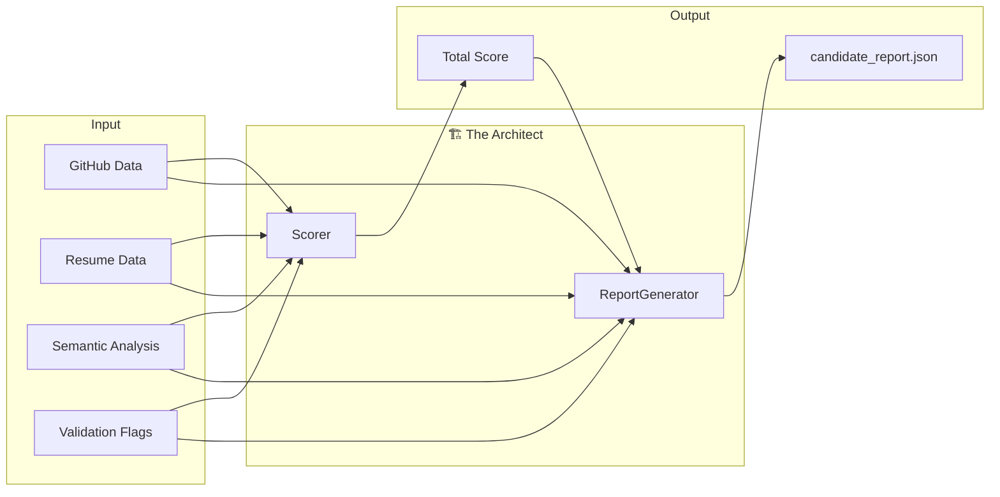

# 📚 The Architect Agent - Knowledge Artifact

## Overview

The Architect Agent is the final stage of the pipeline, responsible for:
1. **Scoring**: Calculating the weighted Technical Alignment Score
2. **Report Generation**: Creating the structured `candidate_report.json`

## Architecture



---

## Module: `scorer.py`

### Purpose
Calculates the final Technical Alignment Score (1-10) using a weighted formula.

### Scoring Formula

```
Total Score = (Technical × 0.40) + (Experience × 0.25) + (Activity × 0.20) + (Credibility × 0.15)
```

| Component | Weight | What It Measures |
|-----------|--------|------------------|
| Technical Match | 40% | Skills alignment with job description |
| Experience Depth | 25% | Years + relevance of experience |
| Activity Score | 20% | GitHub contributions + repo quality |
| Credibility | 15% | Absence of validation flags |

### Individual Score Calculations

#### Technical Match Score
```python
def _calculate_technical_match(self, resume_data, semantic_analysis):
    score = semantic_analysis["technical_match_score"]  # Base from AI
    
    # Adjustments
    if len(matching_skills) >= 5:
        score += 0.5
    if len(missing_skills) >= 4:
        score -= 1.0
```

#### Experience Depth Score
```python
def _calculate_experience_depth(self, resume_data, semantic_analysis):
    years = resume_data["total_years_experience"]
    
    # Years-based base score
    if years >= 10: score = 9.0
    elif years >= 7: score = 8.0
    elif years >= 5: score = 7.0
    # ...
    
    # Blend with AI assessment
    score = (score + ai_relevance_score) / 2
```

#### Activity Score (GitHub)

| Metric | Excellent | Good | Fair | Poor |
|--------|-----------|------|------|------|
| Commits/12mo | 500+ | 200+ | 50+ | <50 |
| Public Repos | 30+ | 15+ | 5+ | <5 |

```python
def _calculate_activity_score(self, github_data):
    commits_score = ...  # Max 4 points
    repos_score = ...    # Max 3 points
    readme_score = ...   # Max 2 points
    streak_score = ...   # Max 1 point
    return min(10, total)
```

#### Credibility Score
```python
def _calculate_credibility(self, validation_flags):
    score = 10.0
    for flag in flags:
        if severity == "HIGH": score -= 3.0
        elif severity == "MEDIUM": score -= 1.5
        else: score -= 0.5
```

### Score Interpretation

| Score Range | Rating | Recommendation |
|-------------|--------|----------------|
| 8.5 - 10 | EXCELLENT | STRONG_YES |
| 7.0 - 8.4 | GOOD | YES |
| 5.5 - 6.9 | FAIR | MAYBE |
| 4.0 - 5.4 | BELOW_AVERAGE | PROBABLY_NO |
| 0 - 3.9 | POOR | NO |

### Debugging Guide

#### Problem: Score seems too low
```python
# Debug: Print breakdown
result = scorer.calculate_score(...)
print(f"Technical: {result['breakdown']['technical_match']}")
print(f"Experience: {result['breakdown']['experience_depth']}")
print(f"Activity: {result['breakdown']['activity_score']}")
print(f"Credibility: {result['breakdown']['credibility']}")
```

#### Problem: Credibility tanking the score
Check the validation flags:
```python
for flag in flags:
    print(f"{flag['severity']}: {flag['description']}")
```
**Solution**: Review if flags are valid or adjust severity in `validator.py`

---

## Module: `report_generator.py`

### Purpose
Creates the final structured JSON artifact with all analysis results.

### Output Structure

```json
{
    "meta": {
        "candidate_id": "uuid",
        "analysis_id": "uuid",
        "generated_at": "2026-01-10T19:30:00Z",
        "version": "1.0.0",
        "engine": "Recruiter Copilot"
    },
    
    "total_score": 7.5,
    
    "reasoning_summary": "Candidate scored 7.5/10 (GOOD). Strong Python background with verified GitHub activity...",
    
    "verified_skills": [
        {
            "skill": "Python",
            "confidence": 0.95,
            "evidence": "Resume, GitHub repos, AI verified"
        }
    ],
    
    "flags": [...],
    
    "detailed_breakdown": {
        "technical_match": 8.0,
        "experience_depth": 7.0,
        "activity_score": 7.5,
        "credibility": 10.0
    },
    
    "github_summary": {...},
    "linkedin_summary": {...},
    "resume_summary": {...},
    
    "ai_analysis": {...},
    
    "raw_data": {...}
}
```

### Verified Skills Algorithm

Skills get confidence scores based on source verification:

| Source | Confidence Added |
|--------|------------------|
| Resume mention | +0.5 (base) |
| GitHub repos | +0.3 |
| AI verification | +0.2 |

Maximum confidence: 1.0

### Save Location

Reports are saved to:
```
recruiter-copilot/reports/candidate_report_{id}_{timestamp}.json
```

### Debugging Guide

#### Problem: Missing data in report
```python
# Check what's None
print(f"GitHub data: {'Present' if github_data else 'MISSING'}")
print(f"Resume data: {'Present' if resume_data else 'MISSING'}")
print(f"AI analysis: {'Present' if semantic_analysis else 'MISSING'}")
```

#### Problem: Report file not saving
```python
# Check directory permissions
print(f"Output dir: {generator.output_dir}")
print(f"Exists: {generator.output_dir.exists()}")
print(f"Writable: {os.access(generator.output_dir, os.W_OK)}")
```

---

## Testing

### Test Scorer
```bash
cd recruiter-copilot
python app/agents/architect/scorer.py
```

### Test Report Generator
```bash
python app/agents/architect/report_generator.py
```

### End-to-End Test
```bash
# Start the API server
uvicorn app.main:app --reload

# Submit a test analysis
curl -X POST http://localhost:8000/api/candidates/analyze \
  -F "github_url=https://github.com/SagnikSaha01" \
  -F "job_description=Senior Python Developer"
```

---

## Common Modifications

### Adjust scoring weights
```python
# In scorer.py
WEIGHTS = {
    "technical_match": 0.50,  # Increase tech importance
    "experience_depth": 0.20,
    "activity_score": 0.15,
    "credibility": 0.15
}
```

### Add new scoring component
1. Create `_calculate_new_component()` method
2. Add to `calculate_score()` calculation
3. Add weight to `WEIGHTS` dict
4. Include in breakdown

### Change report format
Modify the `generate()` method:
```python
report = {
    # Add new sections
    "custom_section": self._generate_custom(...)
}
```

### Add report export formats
```python
def save_as_pdf(self, report):
    # Use reportlab or weasyprint
    pass

def save_as_excel(self, report):
    # Use openpyxl
    pass
```
