# 📚 The Researcher Agent - Knowledge Artifact

## Overview

The Researcher Agent is responsible for gathering raw data from external sources:
- **GitHub**: Public profile, contribution history, languages, repositories
- **LinkedIn**: Work experience, education, skills, certifications

## Architecture

```mermaid
flowchart LR
    subgraph Input
        GH_URL[GitHub URL]
        LI_URL[LinkedIn URL]
    end
    
    subgraph Researcher["🔍 The Researcher"]
        GHS[GitHubScraper]
        LIS[LinkedInScraper]
    end
    
    subgraph Output
        GH_DATA[GitHub Data JSON]
        LI_DATA[LinkedIn Data JSON]
    end
    
    GH_URL --> GHS
    LI_URL --> LIS
    GHS --> GH_DATA
    LIS --> LI_DATA
```



---

## Module: `github_scraper.py`

### Purpose
Extracts comprehensive developer activity data from public GitHub profiles using Playwright browser automation.

### Key Libraries

| Library | Purpose | Documentation |
|---------|---------|---------------|
| `playwright` | Browser automation | [Playwright Python](https://playwright.dev/python/) |
| `asyncio` | Async operations | Built-in Python |
| `re` | Pattern matching | Built-in Python |

### Data Extracted

```python
{
    "username": "SagnikSaha01",
    "commits_12_months": 342,           # From contribution graph
    "top_languages": [                   # From repositories
        {"name": "Python", "repo_count": 15, "percentage": 45.0},
        {"name": "JavaScript", "repo_count": 8, "percentage": 24.0},
        {"name": "Go", "repo_count": 5, "percentage": 15.0}
    ],
    "readme_complexity_score": 7.5,      # 0-10 based on README quality
    "public_repos": 45,
    "followers": 120,
    "following": 85,
    "contribution_streak": 28,           # Days of consecutive activity
    "pinned_repos": [...]                # Detailed pinned repo data
}
```

### Core Logic Explained

#### 1. Profile Navigation
```python
await page.goto(f"https://github.com/{username}", wait_until="networkidle")
```
- Uses `networkidle` to ensure all dynamic content loads
- Sets a realistic User-Agent to avoid bot detection

#### 2. Contribution Graph Parsing
```python
contrib_elem = await page.query_selector("h2.f4.text-normal.mb-2")
# Extracts text like "1,234 contributions in the last year"
```

#### 3. Language Detection
- Navigates to `?tab=repositories`
- Counts `[itemprop='programmingLanguage']` elements
- Calculates percentages based on repo count

#### 4. README Complexity Scoring
```
Score Component      | Points
---------------------|--------
Has README           | 2
Length > 500 chars   | 2
Has images/badges    | 2
Has code blocks      | 2
Has install/usage    | 2
---------------------|--------
Maximum              | 10
```

### Debugging Guide

#### Problem: "Profile not found" error
```python
# Check if 404 page is shown
if await page.query_selector("img[alt='404']"):
    raise ValueError(f"GitHub profile not found: {username}")
```
**Solution**: Verify the username is correct and the profile is public.

#### Problem: Empty contribution data
**Causes**:
1. GitHub changed their HTML structure
2. Profile is private or has no contributions

**Debug steps**:
```python
# Add this to see what's on the page
await page.screenshot(path="debug_screenshot.png")

# Check if contribution graph exists
graph = await page.query_selector("div.js-calendar-graph")
print(f"Graph found: {graph is not None}")
```

#### Problem: Timeout errors
```python
# Increase timeout or check network
await page.goto(url, wait_until="networkidle", timeout=30000)
```

---

## Module: `linkedin_scraper.py`

### Purpose
Scrapes LinkedIn profiles using cookie injection from an authenticated session.

### Key Libraries

| Library | Purpose |
|---------|---------|
| `playwright` | Browser automation |
| `json` | Cookie storage |
| `pathlib` | File path handling |

### Cookie Injection Flow


### Setting Up Cookies

1. Install browser extension "EditThisCookie" or "Cookie Editor"
2. Log into LinkedIn
3. Export all cookies as JSON
4. Save to `recruiter-copilot/linkedin_cookies.json`

**Required cookies:**
- `li_at` - Main session token
- `JSESSIONID` - Session ID
- `bcookie` - Browser cookie

### Fallback Behavior

When scraping fails (blocked, expired cookies), returns:
```python
{
    "linkedin_url": "...",
    "status": "scraping_failed",
    "message": "LinkedIn scraping was blocked..."
}
```

The system gracefully continues analysis with GitHub + Resume data only.

### Debugging Guide

#### Problem: "Cookies not found"
**Solution**: Create the cookies file at the expected path:
```
recruiter-copilot/linkedin_cookies.json
```

#### Problem: "Session expired"
**Symptoms**: Redirected to login page
**Solution**: Re-export fresh cookies from browser

#### Problem: CAPTCHA challenge
**Symptoms**: Page shows captcha
**Solution**: 
1. Open browser manually
2. Solve captcha
3. Re-export cookies

---

## Testing

### Run GitHub Scraper Test
```bash
cd recruiter-copilot
python -c "import asyncio; from app.agents.researcher.github_scraper import test_scraper; asyncio.run(test_scraper())"
```

### Run with Visible Browser
```python
scraper = GitHubScraper(headless=False, slow_mo=500)
```

### Expected Output
```json
{
    "username": "SagnikSaha01",
    "commits_12_months": 234,
    "top_languages": ["Python", "JavaScript", "TypeScript"],
    "readme_complexity_score": 8.0,
    "public_repos": 32
}
```

---

## Common Modifications

### Add new data extraction
1. Identify the CSS selector using browser DevTools
2. Add query selector call
3. Parse the extracted text
4. Add to result dictionary

### Change timeout values
```python
# In __init__
self.timeout = 30000  # milliseconds

# In scrape method
await page.goto(url, timeout=self.timeout)
```

### Enable request logging
```python
page.on("request", lambda req: print(f">> {req.method} {req.url}"))
page.on("response", lambda res: print(f"<< {res.status} {res.url}"))
```
